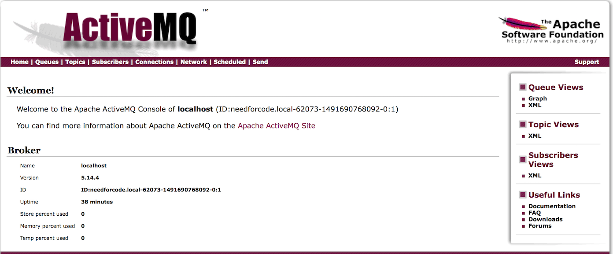
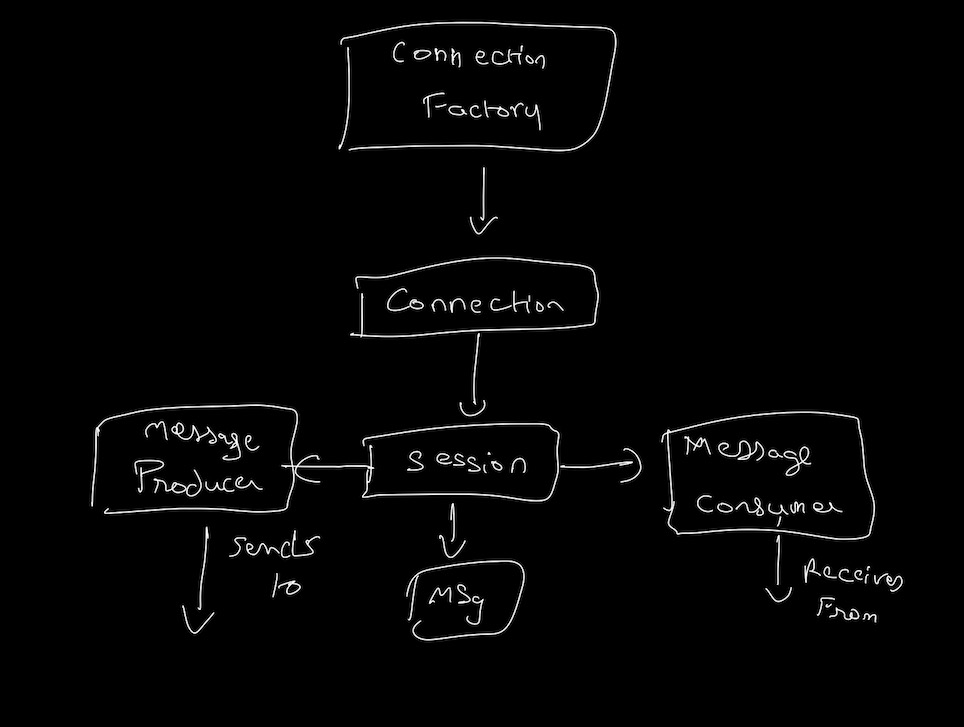
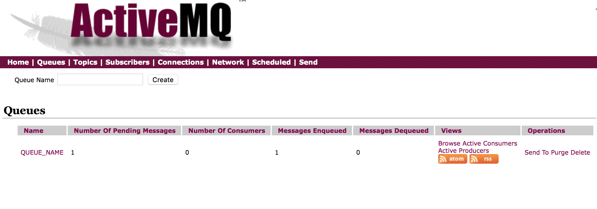
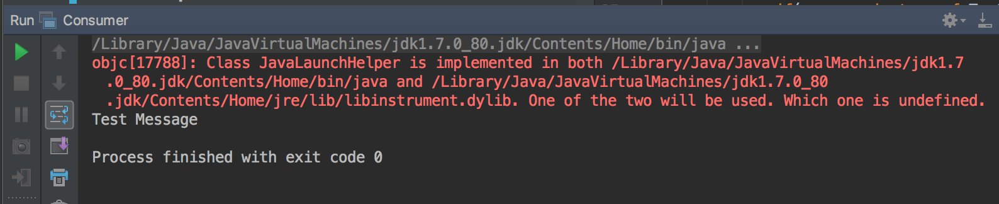

## Active MQ

## JMS

#### Introduction to JMS

#### JMS Glossary
- Provider: An application that sends or receives messages
- producer/publisher: JMS client that creates and sends messages.
- consumer/subscriber: JMS client that receives messages.
- message: Object that contains data that is being sent as message between systems.
- queue: place where messages are queued in one-one/point-point com.needforcode.mongodb.model. Only one consumer can read from queue.
- Topic: Multiple consumer can be able to read from a topic.

#### JMS Models

- **Point-Point** : 
    - Model where messages are sent to a queue and only one consumer can consume and read it. 
    - Any number of producers can send messages to the queue.
    - Messages will be in queue until they expire or consumed by consumer.
- *Pub-Sub* : A publish/subscribe com.needforcode.mongodb.model where multiple consumers can read messages from a topic.
    - Publisher/Subscriber doesn't know about each other.
    - Any number of consumers can consume from a topic.
    
## Active MQ

Its an open source light weight messaging server.


### Installation

```bash
brew install activemq
```

```bash
activemq start
```

Go to http://localhost:8161/admin/ and "admin" as both id and password.



### Java Simple Implementation

#### Java API



#### Dependencies

```xml
    <dependency>
      <groupId>org.apache.activemq</groupId>
      <artifactId>activemq-core</artifactId>
      <version>5.4.3</version>
    </dependency>
```

#### Producer & Consumer

Implement producer & consumer classes as below

- Consumer
- Producer

Run the producer and check the message in the UI



Run the consumer and check the message dequeue in the UI


