## Data Structures

### Types
- Linear: order is maintained. Ex: Array, LinkedList, Stack, Queue.
- Non-Linear: Ex: Trees, Graph

## Arrays

### Features
- Collection of elements. Also called with names Vectors, Tuples.
    - One dimensional array
    - Two dimensional array
- Homogenous (all elements are of same type)
- Ordered

### Types of Arrays
- Static Arrays (fixed size)
  - Have O(1) insertion, deletion and reading.
  - Easy to implement.
- Dynamic Arrays (grow in size as array grows)
  - Flexible in size
  - Perforamance as cost for flexibility
  - Complext to implement than fixed array.

### Usage
- Used to implement lookup tables.
- Implement lists and Strings.
- Many databases consist of 1-D arrays whose elements are records.
- Implment heaps, hash tables, deques, queues, stacks and VLists.
- 2D Arrays are used in graph theory, Image processing and algebraic equations.
  
### Limitations of Arrays
  - Size can't be increased or decreased during runtime.
  - Insertion and deletion on arrays are inefficient.
  - Large datasets, prog run out of memory space.
  
### Problems on Arrays

- Find missing number in array of continuous elements from 1 to n.
- Find missing number in an array of duplicate elements of length n with elements 1 to n.
- Sort a given array
- Sort elements by frequency in an array
- Merge 2 sorted arrays
- Merge 2 unsorted arrays
- Find median of 2 sorted arrays
- Max sum such that no 2 elements are adjacent
- Check if array contains a number
- Find largest and smallest number in an unsorted array
- Find pairs whose sum is equal to given sum
- Find repetitive numbers in array if it contains duplicates
- Remove duplicate elements from an array
- Find an element which repeated only once while all others repeated twice
- Find top 2 elements from unsorted array
- Rearrange positive and negetive numbers in sorted order
- Find sub array with max sum in an array of pos and neg number
- Find length of longest sequence in an array
- Reverse an array
- Find common elements in 3 sorted arrays
- Sort a 2D array by values
- Find an element in sorted 3D array
- Find the duplicate in an array of 10, if a number is repeated 5 times.

## Array Lists

### Features
- Resizable-array implementation of the List interface.
- Dynamic allocation of memory if the list is filled.

### Pros
- Allows usage of Generics
- Dynamic allocation of memory incase array is filled.
- Object oriented
- dynamically add or remove elements

### Limitations
- Needs contiguous blocks of memory for larger arrays.
- Expanding the array list when you want to increase is performance limitation.
- O(n) worst case for insertion.

### Big O

|  Property  |     Array      | Array Lists |
|----------|:-------------:|-----:|
| Access | O(1) | O(1) |
| Search | O(n) | O(n) |
| Insertion | O(1) | O(n) |
| Deletion | O(1) | O(1) |

### Pseudo Code
#### To set an element
```java
set(int index, E item) {
        IOBCheck(index);

        E oldValue = get(index);
        values[index] = item;
        size++;
        return oldValue;
}
```
#### To add an element
```java
add(E item) {
        if (arraySize < arrayLength) {
            values[size++] = item;
            return true;
        } else {
            resizeArray();
            values[size++] = item;
        }
        return false;
}
```
#### To get an element

```java
get(int index) {
        IOBCheck(index);
        return values[index];
}
```
#### To remove an element

```java
remove(int index) {
        IOBCheck(index);
        E oldValue = values[index];
        for (int i = index; i + 1 < values.length; i++) {
            values[i] = values[i + 1];
        }
        values[--size] = null;
        return oldValue;
}
```
#### To find element in an index
```java
indexOf(E o) {
        if (null == o) {
            for (int i = 0; i < values.length; i++) {
                if (values[i] == o) {
                    return i;
                }
            }
        } else {
            for (int i = 0; i < values.length; i++) {
                if (o.equals(values[i])) {
                    return i;
                }
            }
        }
        return -1;
}
```

## Linked Lists 

### Features:
 - Collection of nodes where each node contains field and address of next node.
 - First node is head node and last node is tail node.
 - Nodes are scattered in different memory blocks, need not be contiguous.
 - Compiler dynamically allocates memory space to each node.
 
### Types
- Singly LL
- Doubly LL
- Circular LL
- Multi List (List containing multiple LL)

### Usages
- Trees
- Graphs
- Heaps
- Dynamic Stack
- Dynamic Queue
- Polynomials

### Pros
- Size can be dynamically increased at run time.
- Insertion and deletion are comparatively fast.

### Limitations
- Pointer to next node occupy additional storage space.
- Can't be accessed directly.

### Big O
|  Property  |      Singly LL      | Doubly LL |
|----------|:-------------:|-----:|
| Access | O(n) | O(n) |
| Search | O(n) | O(n) |
| Insertion | O(1) | O(1) |
| Deletion | O(n) | O(n) |

### Problems on LL
- Check if a singly LL is a palindrome.
- Add a node in middle of LL
- Delete a node in middle of LL
- Print singly LL in reverse
- Merge 2 sorted LL
- Delete duplicate value nodes in a LL
- Sort a LL
- Merge a LL into another in alternate positions
- Swap every 2 nodes in a LL
- Delete alternate nodes of a LL
- Delete a node in middle of Singly LL if mid pointer is given.

### Pseudo Code (singly LL)


#### Set an element at an index
```java
set(int index, E item) {
        if(head == null) {
            head = new Node(item,null);
        } else {
            int position=1;
            Node current = head;
            while(position<index) {
                current = current.next;
            }
            Node temp = current.next;
            current.next = new Node(item,temp);
        }
        size++;
        return item;
}
```
#### Add an element
```java
add(E item) {
        if(head == null) {
            head = new Node(item,null);
        } else {
            Node current = head;
            while(current.next!=null) {
                current = current.next;
            }
            current.next = new Node(item,null);
        }
        size++;
        return true;
}
```
#### Get an element at index
```java
get(int index) {
        if(index<-1 && index>size) {
            IOBException(index);
        }
        Node current = head;
        int position=0;
        while(position++ < index) {
            current = current.next;
        }
        return current.item;
}
```
#### Remove an element at index
```java
remove(int index) {
        if(index<-1 && index>size) {
            IOBException(index);
        }
        Node current = head;
        int position = 1;
        while(position < index) {
            current = current.next;
        }
        E oldValue = current.next.item;
        current.next = current.next.next;
        size--;
        return oldValue;
}
```

## Stack

### Features
List where insertion and deletion can be done from one side. LIFO. Linear.
- Homogenous data items which are ordered.
- LIFO

### Stack ADT
- push : inserting element on top of stack
- pop : removes top of stack
- top : returns top of stack
NOTE: all operations above happens in O(1).

### Implementations
- Stack using Arrays
- Stack using LL

### Usage
- Parantesis matching
- Infix to Postfix
- Stack frames for function calls
- Recursive procedures
- MS word undo redo
- Forward and backward in websites
- Towers of Hanoi, Tree traversals, Histogram

### Pros: 
- Easy to implement
- used in applications required LIFO
- Avoids burden of deleting or cleaning up.

### Limitations:
- Stack memory is limited.
- Random access is not possible.

|Operation| Array impl | Linked List impl |
|---------|---|---|
| Create | O(1) | O(1) |
| Destroy | O(1) | O(1) |
| Push | O(1) | O(1) |
| Pop | O(1) | O(1) |
| Is empty | O(1) | O(1) | 
| Is full | O(1) | -- |


### Problems on stack
- Infix to postfix conversion.
- Reverse a string using stack.
- Sort a stack using recursion.
- Implement stack using queue.
- Reverse a stack using recursion.
- implement a stack using 2 queue.

### Pseudo code (Stack using LL)

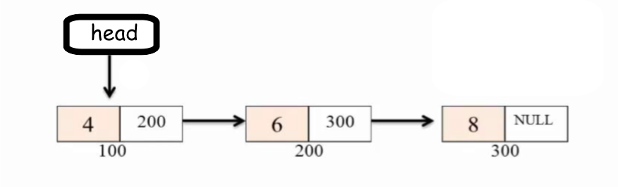

#### Push operation
```java
push(Object item) {
        if(head == null) {
            head = new Node((E)item);
        } else {
            head.next = new Node((E)item);
        }
        size++;
}
```
#### Pop operation
```java
pop() {
        Node temp;
        if(head == null) {
            throw new EmptyStackException("stack is empty");
        } else {
            temp = head;
            head = head.next;
        }
        size --;
        return temp.data;
}
```
#### Peep Operation
```java
peek() {
        Node temp;
        if(head == null) {
            throw new EmptyStackException("stack is empty");
        } else {
            temp = head;
        }
        return temp.data;
}
```

## Queue

### Features
- FIFO
- Homogenous elements
- Insert at rear and remove at front.
- Enqueue, Dequeue, front, isEmpty etc.

### Usages
- Printer Scheduler
- OS use queues to implement scheduling policy
- Queue's in Distributed Computing

### Implementations
- Array
- Linked List

### Circular Queue
- Empty locations in queue can be re-filled by rear pointer unlike normal queue.

### Priority Queue Impl
- Array 
- Linked List
- Heap based

### Problems on Queue
- Implement Queue using 2 stack.
- Max of all sub-arrays of size k.
- Efficiently implement k Queues in a single array.
- Implement deque with insertion, deletion on both sides with O(1).

### Pseudo Code (Queue using LL)

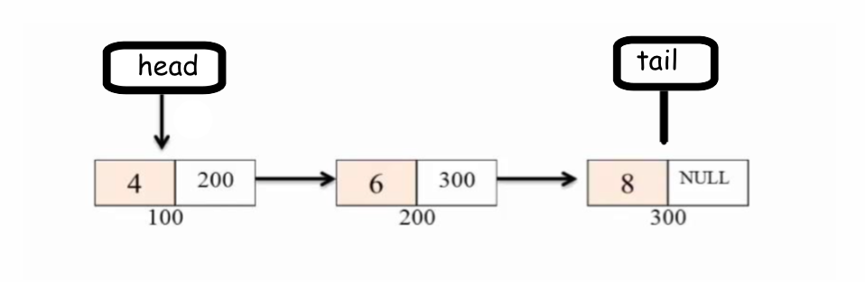

#### EnQueue
```java
EnQueue(E item) {
        Node temp = new Node(item);
        if(head == null) {
            tail = temp;
            head = tail;
        } else {
            tail.next = temp;
            tail = tail.next;
        }
        size++;
}
```
#### DeQueue
```java
DeQueue() {
        if(head == null) {
            throw new EmptyQueueException("queue is empty");
        }
            Node temp = head;
            head = head.next;
        size --;
        return (E) temp.data;
}
```

## Tree


### Features
- Non linear data structure (order is not important).
- The depth of a node is the number of edges from the root to the node.
- The height of a node is the number of edges from the node to the deepest leaf.
- The height of leaf node is 0.

### Types of Trees
- Binary Tree: Each node can have utmost two children.
- Binary search tree: left less than given node, right greater than given node.
- AVL tree:
- Red-Black tree:
- Splay tree: 
- Trie Structure:
- Suffix tree:
- Huffman Tree: 
- B Trees:

### Types of binary Trees
- Perfect Binary Tree: All interior nodes have two children and all leaves have the same depth.
- complete binary tree: every level, except possibly the last, is completely filled, and all nodes in the last level are as far left as possible
- Strict Binary Tree: each node has exactly zero or 2 children.
- Full Binary Tree: Each node has 2 children and all leaf nodes are at same level.
- Ordered Search Trees: data values in left sub tree are less than right tree, no duplicates.
- Expression Tree: Represent Arthematic expression. Operands & Operators in nodes.
- Heap: Data value in any node greater than left sub tree & right sub tree. Can be used in Priority queue.

### Usage
- Hierarchial Structures
- Table of contents
- Unix file system directory structure
- Arithmatic expressions (binary tree)
- Expression trees are used in compilers
- Huffman trees for compression of data
- Hash trees, similar to hash tables
- Routing trees for network traffic
- To solve database problem such as indexing


### Properties of Binary Tree
- No of Nodes in full binary tree: 2h+1 <= N <= 2<sup>(h+1)</sup>-1 where N: No of Nodes h: height of tree.
- No of binary trees are possible with n nodes: 2<sup>n</sup> - n
- Height of a node (len of longest path from it down to leaf): 1+(max(height(left_subtree)+height(right_subtree)))

### Binary Tree Implementation
- Array
- Linked List

### Recursive definition
- Binary tree is a root with left sub tree and right sub tree.

### Tree Traversal
#### Breadth First Traversal:
  
  ```java
  Queue queue = initialize empty queue;

  BFT(TreeNode root) {
    if(root==null) return;
    queue.add(root);
    while(!queue.isEmpty()) {
        TreeNode node = queue.remove();
        print node;
        if(node.left != null) queue.add(node.left);
        if(node.right !=null) queue.add(node.right);
    }
   }
  ``` 
#### Depth First Traversal:
##### Pre Order
Root first, Traverse left sub tree in pre-order, then right sub tree in Pre-Order.

###### Using Recursion:
    
    ```java
    PreOrder(root) {
        Visit the root
        if node.left  ≠ null PreOrder(root.left)
        if node.right  ≠ null PreOrder(root.right)
    }
    ```
    - *Using Iteration*:
    ```java
    PreOrder_Iterative(root) {
        if(root == null) return;
        Stack stack = Init the stack;
        stack.push(root);
        while(!stack.isEmpty) {
            top = stack.top();
            print top
            stack.pop()
                if(root.right !=null) 
                    stack.push(root.right);
                if(root.left !=null)
                    stack.push(root.left);
        }
    }
    ```
##### In Order
- Traverse left sub tree in Inorder, then root, then right sub tree in In Order.
- InOrder traversal prints the sorted order in a BST
###### Using Recursion
    ```java
    InOrder(root) {
        if node.left  ≠ null InOrder(root.left)
        Visit the root
        if node.right  ≠ null InOrder(root.right)
    }
    ```
###### Using Iteration
    ```java
    InOrder_Iterative(root) {
        if(root == null) return;
        Stack stack = Init the stack;
        while(1) {
            while(root!=null) {
                stack.push(root);
                root = root.left;
            }
            root = stack.pop();
            print root;
            root = current.right();
        }
    }
    ```
##### Post Order
Traverse left sub tree Post order, then Right sub tree post order, then root.
###### Using Recursion
    ```java
        PostOrder(root) {
        if node.left  ≠ null PostOrder(root.left)
        Visit the root
        if node.right  ≠ null PostOrder(root.right)
        }
    ```
###### Using Iteration
    ```java
    PostOrder_Iterative(root) {
        if(root == null) return;
        Stack stack = Init the stack;
        while(1) {
            if(root != null) {
                stack.push(root);
                root = root.left;
            } else {
                if(!stack.isEmpty) {
                    if(stack.top().right == null) {
                        root = stack.pop()
                        print root;
                        if(root == stack.top().right) {
                            print stack.pop();
                        }
                    }

                } else {
                    return;
                }
                if(!stack.isEmpty) {
                    root = stack.top().right;
                } else {
                    root = null;
                }
            }
        }
    }
    ```


### Need to balance a Binary Tree

```bash
                1
                 \
                  3
                   \
                    4
                     \
                      5
                       \
                        6
```
If you see above tree in which there is a skew to the right side, the time taken to search,insert is almost equal to O(n) instead of O(logn). we are not making use of binary tree. so we need to balance a binary tree.

### Binary Search Tree
- value of all the nodes in left sub tree are lesser and right sub-tree are greater.
- All the operations insert, delete, search are proportional to height of the tree.

#### Pseudo Code
##### Add a Node
###### Recursive
```java
  AddNode(root,data) {
    if(root == NULL) return new Node(data);
    else if(root.data < data) {
        root.right = AddNode(root.right,data);
    } else if(root.data > data) {
        root.left = AddNode(root.left,data);
    }
    return root;
  }
```
###### Iterative
```java
    AddNode(root,data) {
        if(root==NULL) return new Node(data);
        while(root) {
            if(root.data > data) {
                parent=root;
                root = root.left;
            } else {
                parent=root;
                root = root.right;
            }
        }
        if(parent.data > data) {
            parent.left= new Node(data);
        } else {
            parent.right= new Node(data);
        }
    }
```
##### Search a Node
###### Recursive
```java
      SearchBST(root,data) {
        if(root==null) return "NOT FOUND"
        else if(root.data > data) {
            return SearchBST(root.left,data);
        } else if(root.data < data) {
            return SearchBST(root.right,data);
        }
        return root;
      }
```
###### Non Recursive
```java
        SearchBST(root,data) {
            if(root == NULL) return NULL;
            while(root) {
                if(root.data == data) {
                    return root;
                } else if(root.data > data) {
                    root = root.left;
                } else {
                    root = root.right;
                }
                return NULL:
            }
        }
```

##### Deletion a Node
```java
  DeleteBST(root,data) {
    if(root == NULL) return root;
    else if(data < root.data) {
        root.left = DeleteBST(root.left,data);
    } else if(data > root.data) {
        root.right = DeleteBST(root.right,data);
    } else {
        // no child
        if(root.left == NULL && root.right == NULL) {
            root=NULL;
            return root;
        }
        // one child
        else if(root.left == NULL) {
            temp = root;
            root = root.right;
            DeleteBST temp;
            return root;
        }
        else if(root.right == NULL) {
            temp = root;
            root = root.left;
            DeleteBST temp;
            return root;
        }
        // 2 children
        else {
            temp = FindMininum(root.right);
            root.data = temp.data;
            root.right = DeleteBST(root.right,temp.data);
        }
    }
    return root;
  }
```
### AVL Tree
- It is a BST
- For any node, the height of left & right sub tree differ by 1.

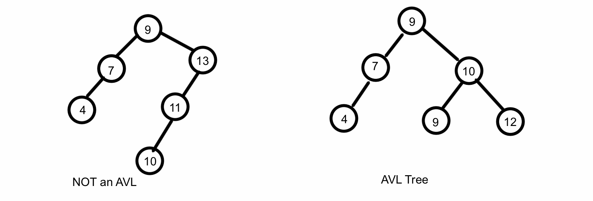

#### Properties of AVL Tree
- The height of an AVL tree storing n elements in it is O(logn)
    Lets try to find minimum no of nodes in AVL tree of height h : n(h)
        n(h) = 1(root node) + n(h-1) + n(h-2)
        By solving h = O(log(n)
- For a tree with K levels the no of the nodes can be  2<sup>(k-1)</sup> < n < 2<sup>(2k-1)</sup>
- Lookup, insertion, and deletion all take O(logn) for best & worst case.
- To calculate balance factor in AVL tree, Balance Factor(BF) = Height(left_sub_tree) - Height(right_sub_tree).

#### Rotations of AVL Tree
Insertion into of the cases. The pre-order before and after rotation stays the same.

- Left of Left sub tree
- Right of Left sub tree
- Left of Right sub tree
- Right of Right sub tree


&copy; wikipedia

#### Pseudo Code (AVL Tree Rotations)
##### Left Rotation
```java
LeftRotate(Node y) {
	Node x = y.left;
	Node z = y.right;

	x.right = y;
	y.left = z;

	//update heights
	y.height = max(height(y.left),height(y.right))+1;
	x.height = max(height(x.left),height(x.right))+1;
	
	return x; 
}
```
##### Right Rotation
```java
RightRotate(Node x) {
	Node y=x.left;
	Node z=x.right;

	x.right=z;
	y.left=x;

	// Update heights
	x.height=max(height(x.left),height(x.right))+1;
	y.height=max(height(y.left),height(y.right))+1;

	return y;
}
```

##### Get Balance
```java
GetBalance(node x) {
 if(x == NULL) return 0;
 return (height(x.left)-height(x.right));
}
```
### Problems on Tree
- Find the max element in a binary tree with recursion.
- Find max element in a binary tree without recursion.
- Search an element in binary tree with recursion.
- Search an element in binary tree without recursion.
- Insert an elment into a binary tree.
- Find the size of binary tree with recursion.
- Size of binary tree using iteration.
- Calculate the height of a binary tree.
- Find height of a binary tree using iteration.
- Find the longest path from the root to leaf in a tree.
- Find the deepest left leaf of a tree.
- Find if 2 binary tree's are structurally identical.
- Find the level which has maximum sum in a binary tree.
- Print all the root to leaf paths in a binary tree.
- Print all the nodes in path from root to the given node.
- Level order traversal in spiral form.
- Find running weighted median from a stream of values and weights


## Heap

Heap is a binary tree that satisfies the following conditions.

- A complete binary tree, all levels except last are fill & last is left fill.
- Data item stored in each node is greater or equal to item in its children.
- Height is always O(logn)
- No of nodes in a Heap of Height h
	- No of nodes in complete binary tree of height h-1 = 2<sup>h</sup>-1
	- No of nodes in complete binary tree of height h = 2<sup>(h-1)</sup>-1
	- So total no of nodes in Heap = 2<sup>h</sup>-1 < n <= 2<sup>(h-1)</sup>-1
	- h = [log<sub>2</sub>n] ([] mean floor)

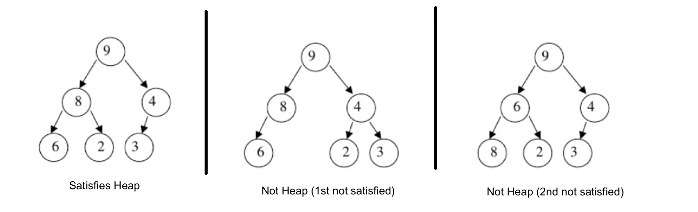

- *Min Heap* : A[parent(i)] <= A[i]
- *Max Heap* : A[parent(i)] >= A[i]

### ADT

- Insert(x,S) : insert x into set S.
- max(S) : return max element from S.
- extract_max(S) : remove max element from S.

### Heap Operations

- BuildMinHeap : build a min heap from unordered array.
- Maxheapify: correct single voilation of heap property in a subtree's root.

### Implementing Heaps

Implementation  | remove() | insert()
------------- | ----------|---
Sorted Array  | O(1) | O(n)
Unsorted Array  | O(n) | O(1) 
Heap | O(log<sub>2</sub>n) | O(log<sub>2</sub>n)

#### Heap as Array
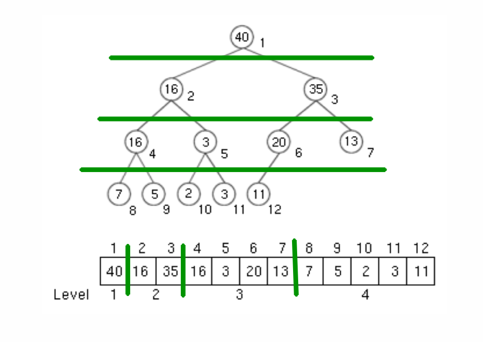

```java
HeapInsert(data) {
	if(heapSize=arraySize) {
		increaseCapacity();
	}
	array[++size]=data;
	HeapifyUP(size);
}

HeapifyUP(index) {
	while(index/2 > 1 && array[index/2]>array[index]) {
		swap(array[index/2],array[index]);
		index=index/2;
	}
}

HeapRemoveMin() {
	removed = array[1];
	array[1]=array[size];
	HeapifyDown(1);
	return removed;
}

HeapifyDown(index) {
	while(2*index <= size && array[2*index] < array[index]) {
		swap(array[2*index],array[index]);
		index=index*2;
	}
}

HeapMinElement() {
	if(heapSize>1) 
		return array[0];
	else
		Heap is Empty Exception	
}
```
### Applications of Heap

- Priority Queue implemented using Binary Heap
- Priority Queue's are used in Prim’s Algorithm and Dijkstra’s algorithm.

### Problems on Heap

- Is an array that is sorted in decreasing order a max-oriented heap ?
- Why is Binary Heap Preferred over BST for Priority Queue ?
- kth largest element in an array ?
- Sort an almost sorted array.
- Check if given binary tree is a Heap.
- Check if given array is Binary Heap.
- Merge K sorted arrays.
- Finding median of min heap in linear time.
- Find running median from a stream of Integers.
- There is a big file of words which is dynamically changing. We are continuously adding some words into it. How would you keep track of top 10 trending words at each moment?
- What are the minimum and maximum numbers of elements in a heap of height h?
- Show that an n-element heap has height [logn] 

## Priority Queue

- Every entry contains key and associated value.
- Entry with highest priority is dequeued first.

### ADT

- insert(item, priority)
- getHighestPriority()
- removeHighestPriority()
- empty()
- size()

### Big O

Insert  | Delete
------------- | -------------
O(logn)  | O(logn)

### Applications

- Job Scheduling

## Double Ended Priority Queue

## Graph
- Non Linear DS
- Collection of Vertices and Edges
- Graph G=(V,E) where (V,E) is ordered pair (V,E) != (E,V)

### Types

- **Directed vs Undirected Graph**


- **Weighted vs UnWeighted Graph**

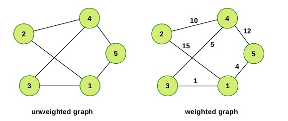
&copy; Prof Christian

- **Strongly Connected**


- **Acyclic graph**
	- which you can travel in only one direction.
	- You can't come back to the same vertex again.

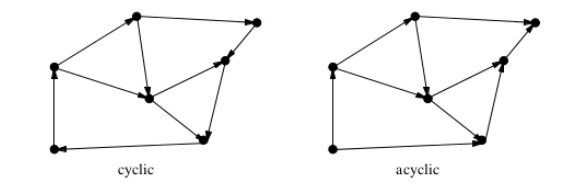

### No of edges
	if |V| = n 
	then 0<= |E| <= n(n-1), if directed
	0 <= |E| <= n(n-1)/2
	
### Graph Applications

- Electronic circuits 
- Transportation Networks
- Social Networking sites
- Computer Networks (LAN, WAN, MAN)
- Databases (ER relationship diagrams)
	
### Graph Implementations

#### Edge List

##### Non Weighted graph (Edge List)

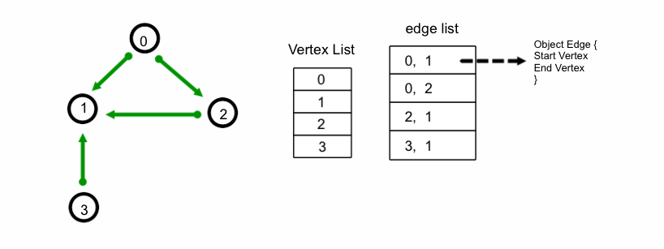

##### Weighted graph (Edge List)

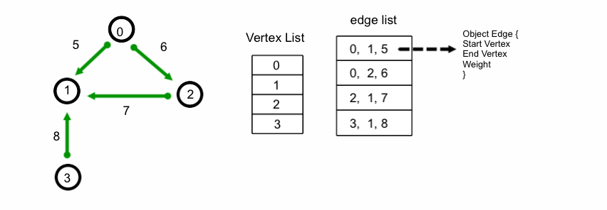

> Space Complexity of Vertex List = O(|V|)
> Space Complexity of Edge List = O(|E|)

- To see if 2 vertices or nodes are connected you need to perform a linear search on the edge list.
- Performing a linear search on the edge list is O(|E|) 
- O(|E|) is directory proportional to O(|V| * |V|) (since |E| = |V|*(|V|-1)) where |V| = n

#### Adjacency Matrix

Here to find the vertices connected to a vertex, we just need to find index of vertex in vertex List ( which is O(|V|) and need to scan the index row of matrix which is again O(|V|)

> Time Complexity: O(|V|) + O(|V|) = O(|V|)
> Space Complexity:  O(|V^2|)

- This is good for dense graphs.
- Otherwise the init of matrix itself take O(|V<sup>2</sup>|)
			
##### Symmetric (Un Directional graph)
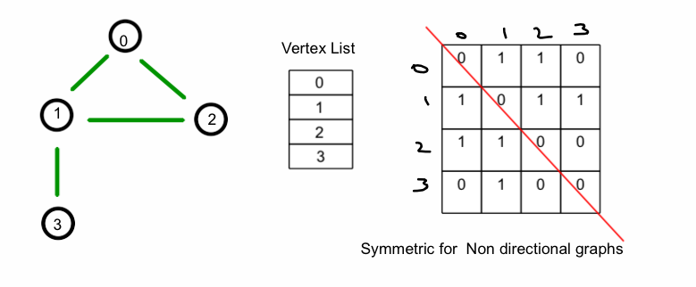

##### Non Symmetric (Directional graph)
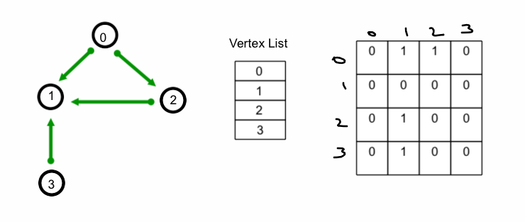

#### Adjacency List
##### Using Array or ArrayList
> Time Complexity: O(|V|)  (linearly search index of vertex)+ O(|V|) (traverse in matric of particular row of index searched) = O(|V|)
			Space Complexity:  < O(|V2|) 
			
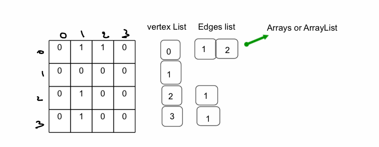

- If you use arrays in Adjacency list for storing edges, you have to create new array if array is completely filled, if a new node is inserted which is O(n), so better use linked list instead of array or array list.

##### Using LL
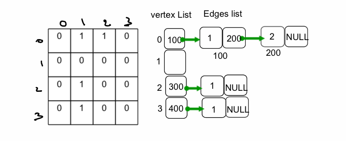

- You can also use a Tree DS which has O(log n) for all operations.

### Traversal of graphs

#### Breadth First Traversal (BFS)

- Traversing nodes in layers, layer 1 first, then layer 2 etc.
- In order to avoid visited node twice, we mark boolean visited.

```java
BFS_Iteration() {
	mark all the nodes as not_visited;
	Queue queue = new Queue();

	queue.enqueue(first_element);

	while(!queue.is_empty()) {
		var = queue.dequeue();
		if(var is not visited) {
			mark var as visited;
			print var;
		}
		for(adj: var.get_adjacentVertices()) {
			queue.enqueue(adj);
		}
	}
}
```

#### Depth First Traversal (DFS)
##### Recursive
```java
procedure DFS(G,v) {
	label v as visited
	print v;
	for(adj : all adjacent neighbours of v) {
	    if (vertex adj is not visited) {
	    		DFS(G,adj);
	    }
	}
}
```
##### Iterative
```java
DFS_Iteration() {
	set all nodes to not_visited;
	s=new Stack();
	s.push(initial_node);

	while(stack not empty) {
		var = s.pop();
		if(var not visited) {
			set var to visited;
			print var;
			for(adj: all adjacent of var) {
				if(adj not visited) {
					s.push(adj);
				}
			}
		}
	}
}
```

### Big O

Implementation  | Check edge bw v1 & v2 | Iterate over edges of v | Add Vertex | Add Edge |
------------- | ------------- | ------- | ----- | ---- |
Edge List  | \|E\| or \|V<sup>2</sup>\| | \|E\| | O(1) (if index given) <br/> O(v) if vertex given | O(1) (if index given) <br/> O(v) if vertex given |
Adj Matrix  | O(1) | O(\|V\|) | O(1) (if index given) <br/> O(v) if vertex given | O(1) (if index given) O(v) <br/> if vertex given |
Adj List | < O(\|V\|) | < O(\|V\|) | | |

## Summary
### Big O Complexity

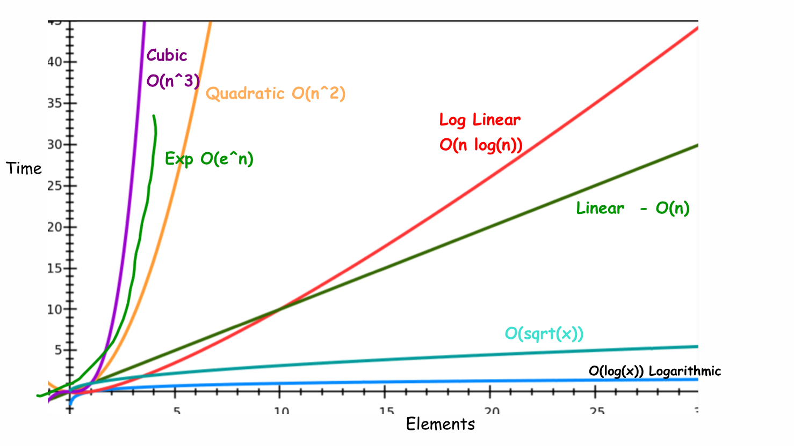

### Big O 

| Lists                	| Average 	| Average 	| Average  	| Average       	| Worst  	| Worst      	| Worst    	| Worst         	|
|----------------------	|---------	|---------	|----------	|---------------	|--------	|------------	|----------	|---------------	|
|                      	| Insert  	| Get     	| Search   	| Delete(index) 	| Insert 	| Get(index) 	| Search   	| Delete(index) 	|
| Array                	| O(1)    	| O(1)    	| O(n)     	| O(n)          	| O(1)   	| O(1)       	| O(n)     	| O(n)          	|
| Sorted Array         	| O(n)    	| O(1)    	| O(log n) 	| O(n)          	| O(n)   	| O(1)       	| O(log n) 	| O(n)          	|
| Dynamic Array        	| O(1)    	| O(1)    	| O(n)     	| O(n)          	| O(n)   	| O(1)       	| O(n)     	| O(n)          	|
| Dynamic Sorted Array 	| O(n)    	| O(1)    	| O(log n) 	| O(n)          	| O(n)   	| O(1)       	| O(log n) 	| O(n)          	|
| Singly Linked List   	| O(1)    	| O(n)    	| O(n)     	| O(n)          	| O(1)   	| O(n)       	| O(n)     	| O(n)          	|
| Doubly Linked List   	| O(1)    	| O(n)    	| O(n)     	| O(n)          	| O(1)   	| O(n)       	| O(n)     	| O(n)          	|
| Circular Linked List 	| O(1)    	| O(n)    	| O(n)     	| O(n)          	| O(1)   	| O(n)       	| O(n)     	| O(n)          	|
| Skip List            	| O(1)    	| O(n)    	| O(n)     	| O(n)          	| O(n)   	| O(n)       	| O(n)     	| O(n)          	|
| Stack                	| O(1)    	| O(1)    	| O(n)     	| O(1)          	| O(1)   	| O(n)       	| O(n)     	| O(1)          	|
| Queue                	| O(1)    	| O(1)    	| O(n)     	| O(1)          	| O(1)   	| O(1)       	| O(n)     	| O(1)          	|
| BST                	| O(log n)    	| O(log n)    	| O(log n)     	| O(log n)          	| O(n)   	| O(n)       	| O(n)     	| O(n)          	|
| AVL Tree                	| O(log n)    	| O(log n)    	| O(log n)     	| O(log n)          	| O(log n)   	| O(log n)       	| O(log n)     	| O(log n)          	|
| Red Black Tree                	| O(log n)    	| O(log n)    	| O(log n)     	| O(log n)          	| O(log n)   	| O(log n)       	| O(log n)     	| O(log n)          	|


