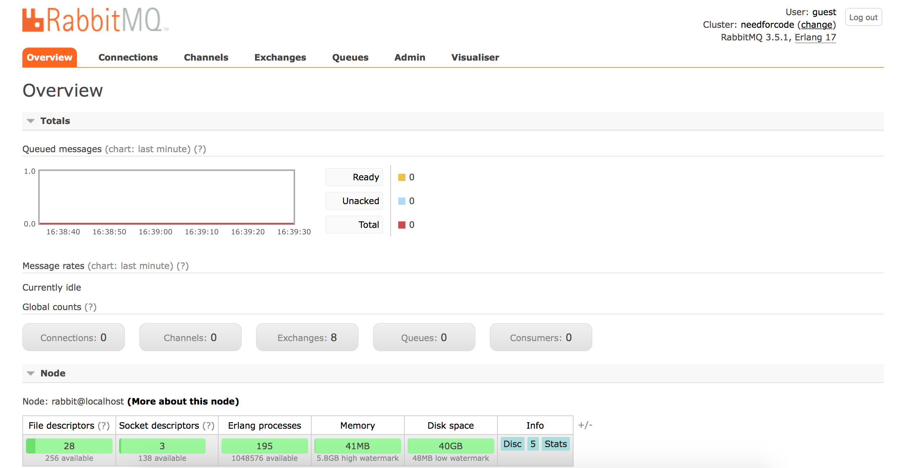
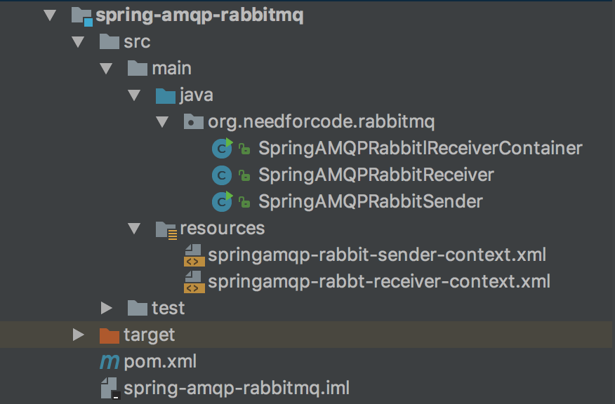

## Rabbit MQ Quick start

## Installation

Installation on mac OSX can be easily done using [Homebrew](http://brew.sh/) with out worrying 
about conflicts.

```bash
## we are installing v3.5.1 using below command as root user.
brew install rabbitmq

## You might get one of these [errors](http://stackoverflow.com/questions/19039404/error-cowardly-refusing-to-sudo-brew-install-for-installing-glue-0-3-for-mac).

## Change to your user after the installation. Please give below permissions.

sudo chown "user" /usr/local/var/lib/rabbitmq/
sudo chown "user" /usr/local/var/log/rabbitmq/

```

You need to set the PATH variable too. Refer [here](http://stackoverflow.com/questions/23050120/rabbitmq-command-doesnt-exist)

Type "rabbitmq-server" to start the server.

You can open rabbit mq admin UI at http://localhost:15672/

Type "guest" "guest" as user and password"



## Architecture


### com.needforcode.activemq.Producer

- connect to rabbit mq broker using tcp connection
- obtain a virtual channel
- declare an exchange
- create a message
- publish the message
- close the channel
- close the connection

### Consumers

Consumers connect to queue in 2 ways

- basic.consume - subscribe to queue and keep listening
- basic.get - subscribe , get message, unsubscribe

If more than 1 consumer connected, messages are sent in round-robin fashion.
If consumer didn't ack the message and disconnects, then rabbit will send that message to another consumer.

Here is consumer flow

- establish connection to broker
- obtain channel
- declare exchange
- declare on queue
- bind the exchange and queue
- process incoming message
- acknowledge

## JMS VS AMQP

| JMS | AMQP |
|---|---|
| Tightly couped to Java | can develop in any languages if standards implemented |
| peer-peer & pub-sub | support 5 kinds of routing | 
| JMS has queues and topics as targets for publishing messages | AMQP only sends to exchanges with routing keys |


## Commands

Start the server

```bash
rabbitmq-server
# Open at 
```

To know the status of rabbit mq

```bash
rabbitmqctl status
```

To list queues 

```bash
rabbitmqctl list_queues
```

List queue with properties

```bash
rabbitmqctl list_queues name messages consumers memory durable auto_delete
```

List exchanges

```bash
rabbitmqctl list_exchanges
```

List exchanges with properties

```bash
rabbitmqctl list_exchanges name type durable auto_delete
```

List Bindings

```bash
rabbitmqctl list_bindings
```

## Spring rabbit MQ 

Spring RabbitMQ AMQP API

- spring-amqp (abstraction)
- spring-rabbit

### Project Structure



### Dependencies

```xml
 		<dependency>
            <groupId>org.springframework.amqp</groupId>
            <artifactId>spring-rabbit</artifactId>
            <version>1.1.1.RELEASE</version>
        </dependency>
        <dependency>
            <groupId>org.springframework.amqp</groupId>
            <artifactId>spring-amqp</artifactId>
            <version>1.1.4.RELEASE</version>
        </dependency>
        <dependency>
            <groupId>org.springframework</groupId>
            <artifactId>spring-context</artifactId>
            <version>3.1.1.RELEASE</version>
        </dependency>
```

###  Edit xml files for spring

- springamqp-rabbit-sender-context.xml
- springamqp-rabbt-receiver-context.xml

### Edit following java classes

- SpringAMQPRabbitlReceiverContainer.java
- SpringAMQPRabbitReceiver.java
- SpringAMQPRabbitSender.java

### Run the app


